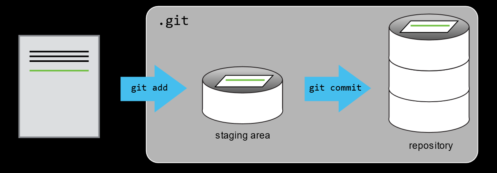
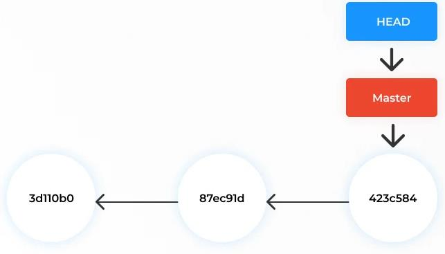
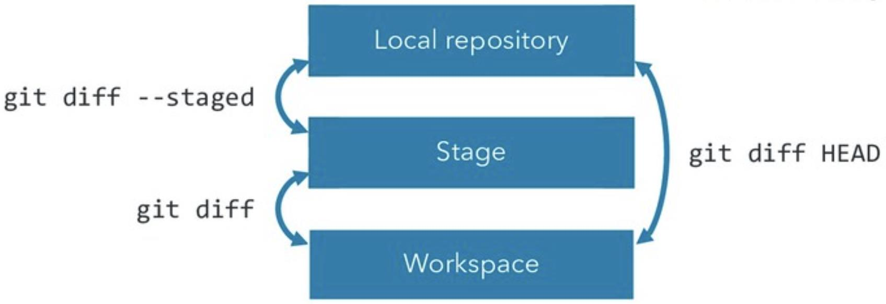

## Getting started

You know *why* Git matters now — time to actually use it. First, check it's
installed and tell it who you are:

```bash
git --version

git config --global user.name "Your Name"
git config --global user.email "your.email@uzh.ch"
```

These are embedded in every commit you make.

---

## There are many git commands...

Before diving in, a reality check — Git is a big tool:

```
add       clone     commit    diff      fetch     init
log       merge     pull      push      remote    reset
branch    checkout  stash     status    tag       ...
```

. . .

**We will focus on about 12 of them today.**

The rest you can look up when you need them — `git help <command>`

---

## A running example: tracking an experiment

Let's make those 12 commands concrete. Throughout today we will build one
realistic project — `experiment-tracker` —
the kind of folder you might keep next to a real experiment: sample metadata,
analysis notes, and a results summary. No programming language required.

```bash
cd ~/Downloads
mkdir experiment-tracker
cd experiment-tracker
git init
ls -a    # confirm the hidden .git folder was created
```

The `.git` folder is where Git stores everything. Never delete it.

---

## Tracking changes — the three stages

Every change you make moves through three places, in order:

**Working Directory** → (`git add`) → **Staging Area** → (`git commit`) → **Repository**

. . .

Why a staging area? Imagine you fixed a bug **and** started an unrelated
experiment in the same session. The staging area lets you commit the bug
fix alone, with its own clear message — without dragging in the half-finished
experiment. We'll see this as a diagram once you've done it by hand.

---

## Your first file: sample metadata

Your repository exists but is empty. Let's put something in the working
directory — step 1 of the three stages:

```bash
nano samples.csv
```

```
sample_id,condition,replicate
S01,control,1
S02,control,2
S03,treated,1
S04,treated,2
```

`Ctrl+X → Y → Enter` to save and close.

---

## git status

The file exists, but Git hasn't been told to track it. Check what Git sees:

```bash
git status
```

```
On branch main

No commits yet

Untracked files:
  (use "git add <file>..." to include in what will be committed)
        samples.csv
```

Git sees the file but is not tracking it yet.

---

## git add → git commit

::: {.panel-tabset}

### Terminal

```bash
# Stage the file
git add samples.csv

git status   # now it shows "Changes to be committed"

# Commit
git commit -m "added sample metadata for 4 samples"

git status   # now: "nothing to commit, working tree clean"
```

### VS Code (Source Control panel)

1. Open the **Source Control** icon in the left sidebar (or `Ctrl+Shift+G`)
2. Under "Changes," hover `samples.csv` → click **+** to stage it
   (it moves up to "Staged Changes" — this IS `git add`)
3. Type your commit message in the box at the top
4. Click the **✓ Commit** button — this IS `git commit -m`

::: {.callout-tip}
The CLI and the GUI do the exact same thing underneath. Use whichever helps
you *see* what's happening — many people find staging easier to understand
visually before they trust it from the terminal.
:::

:::

---

## git log

```bash
git log
```

```
commit ac3eveta1234...
Author: Deepak Tanwar <deepak@uzh.ch>
Date:   Mon Jun 23 09:45:00 2025

    added sample metadata for 4 samples
```

```bash
git log --oneline   # compact view
```

---

## The staging area recap

{width="85%" fig-align="center"}

You can inspect the staging area at any point with `git diff --staged`.

---

## HEAD

HEAD = pointer to the **latest commit** on your current branch.

{width="70%" fig-align="center"}

When you make a new commit, HEAD moves forward automatically.

::: {.callout-tip}
Think of HEAD as a sticky note that says "you are here" — it always points
to the tip of whichever branch you're currently on.
:::

---

## git diff

Diffing shows **what changed** between two states:

{width="60%" fig-align="center"}

::: {.panel-tabset}

### Terminal

```bash
# Working directory vs staging area (unstaged changes)
git diff

# Staging area vs last commit (what will be in next commit)
git diff --staged

# Working directory vs last commit (everything changed)
git diff HEAD

# Two specific commits
git diff <hash1> <hash2>
```

Terminal diffs use `+`/`-` prefixes per line — green `+` for added, red `-`
for removed.

### VS Code

1. In the **Source Control** panel, click any modified file under "Changes"
2. VS Code opens a **side-by-side diff view** automatically — old version on
   the left, new on the right, changed lines highlighted in color
3. Click a file under "Staged Changes" to see exactly what's about to be committed

For a long file, the side-by-side view is much faster to scan than reading
`+`/`-` lines in the terminal.

:::

---

## Exercise 3 — Local Git Workflow

See [Exercise 3](../exercises/exercise_3_local_git.qmd) for the full walkthrough.

**Summary:**

1. `mkdir experiment-tracker && cd experiment-tracker && git init`
2. Create `samples.csv` with sample metadata, `git add`, `git commit`
3. Create `analysis_log.md`, document a step, add, commit
4. `git log --oneline` — see all your commits
5. `git diff` before staging; `git diff --staged` after staging
6. Compare first and last commit: `git diff HASH1 HASH2`
