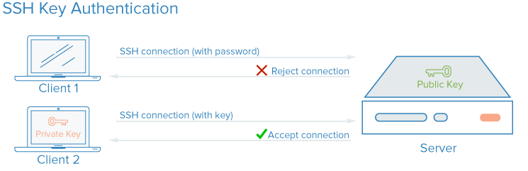

## SSH Authentication

Everything so far has lived only on your machine — concept 6 from this
morning, **remote**, is what we're missing. Before connecting to GitHub, it
needs to know it's really you. SSH lets your computer talk to GitHub
without typing a password every time.

{width="85%" fig-align="center"}

::: {.callout-note}
The private key never leaves your machine. GitHub only ever sees the
public key — that's why it's safe to share, and the private key is not.
:::

```bash
# Check for existing key
ls -al ~/.ssh

# Generate new key
ssh-keygen -t ed25519 -C "your.email@uzh.ch"

# Copy public key → paste into github.com/settings/keys
cat ~/.ssh/id_ed25519.pub

# Test
ssh -T git@github.com
```

---

## Connecting local to remote

```bash
# Link your local repo to GitHub
git remote add origin git@github.com:USERNAME/REPO.git

# Verify
git remote -v
```

`origin` is just the conventional name for your primary remote.

---

## git push

Share your commits with GitHub:

```bash
# First time — push and set upstream
git push -u origin main

# Every time after
git push
```

. . .

::: {.callout-note}
`git push` only uploads **commits**. Uncommitted changes stay local.
:::

---

## git pull

Get the latest changes from GitHub:

```bash
git pull
```

Under the hood this is two steps:

```bash
git fetch    # download new commits
git merge    # merge them into your branch
```

. . .

**Run `git pull` at the start of every work session.**

::: {.callout-tip}
**VS Code equivalent:** the bottom-left status bar shows your branch name
with up/down arrow counts (e.g. `main ↑2 ↓1`) — 2 commits to push, 1 to
pull. Click the **sync icon** next to it to pull then push in one click.
:::

---

## git clone

Copy an entire repository to your machine:

```bash
git clone git@github.com:DQBM-SIB/intro_git_github.git

# Into a custom folder name
git clone git@github.com:DQBM-SIB/intro_git_github.git my-folder
```

Clone includes the full history and sets up `origin` automatically.

---

## The full remote workflow

Every command you've seen today, in the order you'll actually use them:

```bash
git clone <url>           # 1. get the repo (first time only)
# or: git pull            # 1. get latest (if you already have it)

git checkout -b feature   # 2. work on a branch

# make changes...

git add --all             # 3. stage
git commit -m "message"   # 4. commit
git push origin feature   # 5. push branch to GitHub

# 6. open Pull Request on GitHub
# 7. after merge:
git checkout main
git pull
```

Steps 6 and 7 mention things we haven't covered yet — Issues, Projects,
and Pull Requests. That's the rest of this module.

---

## GitHub Issues

Track tasks, bugs, and discussions — all in one place.

- **Bug report:** "Script crashes on paired-end input"
- **Feature request:** "Add support for BAM files"
- **Task:** "Write documentation for pipeline module"

. . .

Reference issues in commit messages:

```bash
git commit -m "fixed alignment bug, closes #12"
```

→ Automatically closes issue #12 when the PR is merged.

---

## GitHub Projects

Issues are individual cards. A Project is the board that organizes them.

```
| To Do      | In Progress | Done       |
|------------|-------------|------------|
| Issue #1   | Issue #3    | Issue #2   |
| Issue #4   |             |            |
```

Drag cards as work progresses.
Link issues so they move automatically when a PR closes them.

---

## Pull Requests

We planned the work with Issues and Projects. Now the actual code change:
a Pull Request is a proposal to merge your branch into another branch.

```{mermaid}
flowchart LR
    A[your-branch] -->|Pull Request| B[main]
    B -->|review + discuss| A
    A -->|merge| B
```

**PR workflow:**
1. Push your branch: `git push origin my-feature`
2. Open PR on GitHub: **Compare & pull request**
3. Write a description: what changed, why, issue reference
4. Request a reviewer
5. Address review comments with new commits
6. Merge

---

## Fork vs Clone

| | Fork | Clone |
|--|------|-------|
| **Where** | GitHub (server copy) | Your machine (local copy) |
| **When** | Contributing to someone else's repo | Working on any repo locally |
| **Push to** | Your fork → PR to original | Original (if you have permission) |

**Fork workflow:**

```{mermaid}
flowchart LR
    A[Fork on GitHub] --> B[Clone your fork]
    B --> C[Branch]
    C --> D[Edit & commit]
    D --> E[Push to your fork]
    E --> F[Pull Request to original]
```

---

## Exercise 5 — Push & Pull

See [Exercise 5](../exercises/exercise_5_push_pull.qmd)

1. Create GitHub repo (no README)
2. `git remote add origin <ssh-url>`
3. `git push -u origin main`
4. Edit README on GitHub → `git pull` locally
5. Edit locally → `git push` → check on GitHub

---

## Exercise 6 — Fork & Pull Request

See [Exercise 6](../exercises/exercise_6_collaboration.qmd)

1. Fork `DQBM-SIB/intro_git_github`
2. Clone your fork
3. `git checkout -b YOUR_FIRST_NAME`
4. Add your section to `projects.md`
5. `git push origin YOUR_FIRST_NAME`
6. Open a Pull Request → reference your issue
